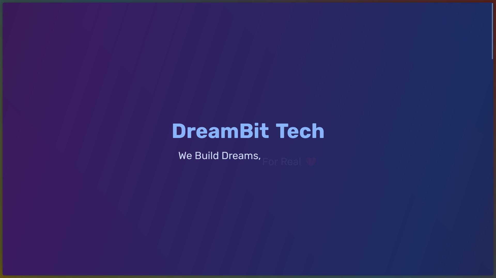
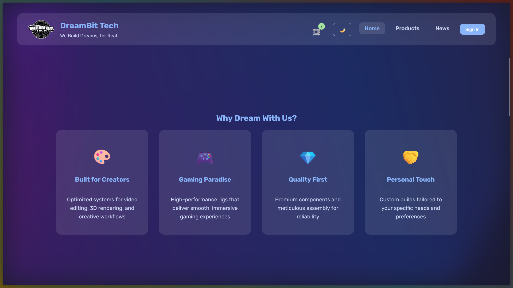
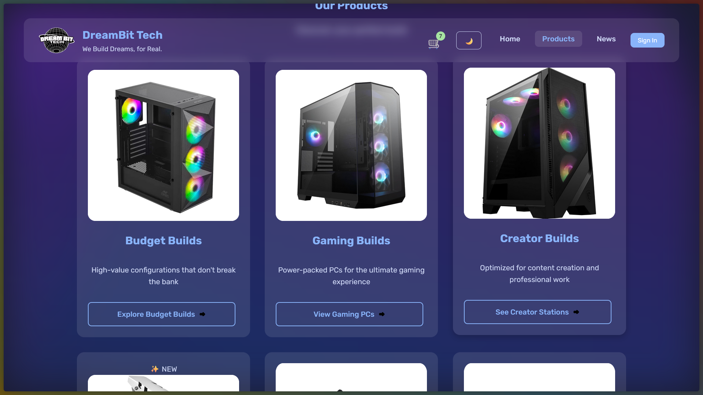
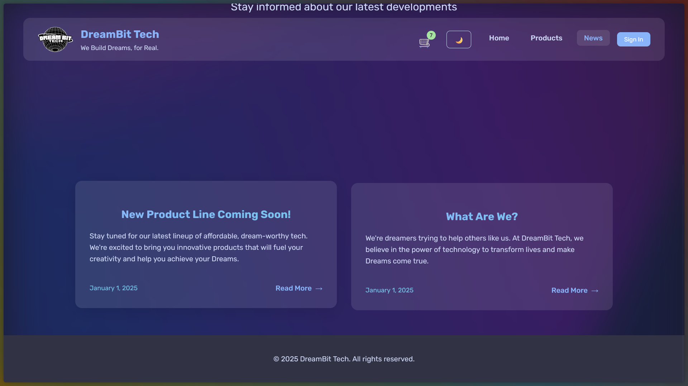
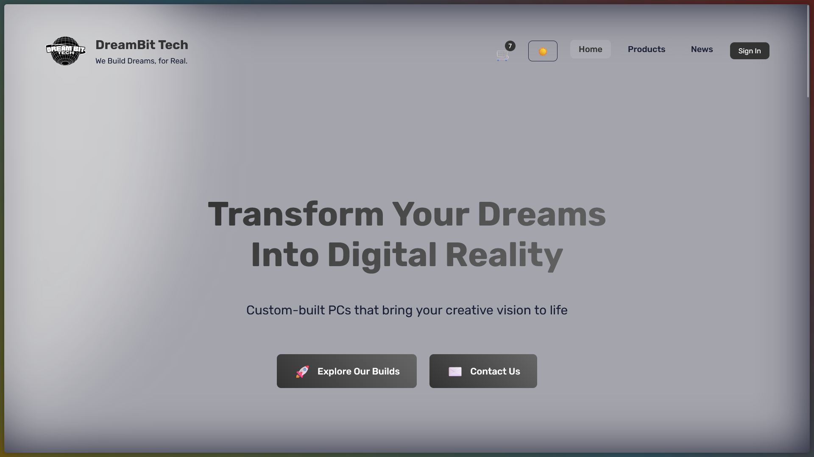
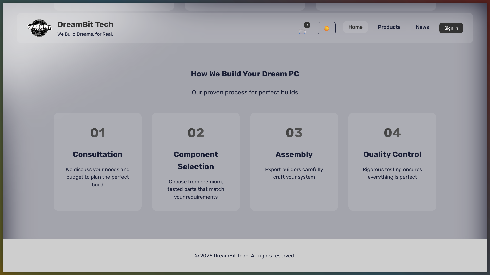

  

# Personal E-Commerce Project

A comprehensive full-stack e-commerce website representing my journey into modern web development. This project evolved from a simple concept into a feature-rich application, demonstrating my growth from basic HTML/CSS to implementing complex systems and industry-standard practices.

## 🌐 Live Demo

Check out the live version of the project: [DreamBitTech](https://dreambittech.rf.gd)

## 🎯 Project Goals

- Build a production-ready web application with real-world functionality
- Master fundamental and advanced web development concepts
- Implement secure and scalable database management systems
- Learn deployment strategies and hosting solutions
- Create responsive, accessible, and user-friendly interfaces
- Develop strong problem-solving and debugging skills
- Practice modern development workflows and version control

## 🛠️ Technologies Used

### Frontend
- HTML5 with semantic markup
- CSS3 with Flexbox and Grid
- JavaScript (ES6+)
- Responsive design with mobile-first approach
- Custom animations and transitions
- Modern UI/UX principles

### Backend
- Node.js runtime environment
- Express.js framework
- RESTful API architecture
- JWT authentication
- Error handling middleware
- Input validation and sanitization

### Database
- MySQL for primary data storage
- Efficient query optimization
- Proper indexing strategies
- Data normalization
- Backup and recovery systems

### Authentication & Security
- Clerk for user management
- Password hashing and encryption
- CSRF protection
- XSS prevention
- Rate limiting
- Security headers implementation

### Development & Deployment
- Git for version control
- Vercel for hosting
- CI/CD pipeline
- Environment configuration
- Performance optimization
- Code splitting and lazy loading

## 📸 Project Screenshots

### Home and Product Pages

  
  
  
<em>Left: Homepage with featured products and categories | Right: Product listing with filter options</em>

### User Interface

  
  
  
<em>Left: Shopping cart with real-time updates | Right: Personalized user dashboard</em>

### Shopping Experience

  
  
  
<em>Left: Detailed product view with specifications | Right: Streamlined checkout process</em>

## 🌟 Key Features

### User Experience
- Intuitive navigation and search functionality
- Advanced filtering and sorting options
- Real-time cart updates
- Wishlist management
- Order history and tracking
- Personal profile customization

### Shopping Features
- Dynamic product catalog
- Smart search suggestions
- Multiple payment options
- Secure checkout process
- Order confirmation emails
- Invoice generation

### Admin Capabilities
- Comprehensive dashboard
- Inventory management
- Order processing system
- User management
- Analytics and reporting
- Content management system

## 💡 Learning Outcomes

This project provided invaluable experience in:

### Technical Skills
- Database architecture and optimization
- RESTful API design and implementation
- Frontend-Backend integration
- Security best practices
- Performance optimization
- Responsive design techniques

### Development Practices
- Git workflow and collaboration
- Code documentation
- Testing strategies
- Debug and troubleshooting
- Clean code principles
- Project organization

### Business Understanding
- E-commerce business logic
- Payment gateway integration
- User behavior analysis
- Performance metrics
- Security compliance
- SEO fundamentals

## 🚀 Future Improvements

### Short-term Goals
- [ ] Implement real-time order tracking
- [ ] Add user reviews and ratings
- [ ] Integrate additional payment gateways
- [ ] Enhanced search functionality with filters
- [ ] Mobile app development

### Mid-term Goals
- [ ] Product recommendation system
- [ ] Advanced analytics dashboard
- [ ] Multi-language support
- [ ] Social media integration
- [ ] Email marketing integration

### Long-term Vision
- [ ] AI-powered customer service
- [ ] Inventory prediction system
- [ ] AR product visualization
- [ ] Loyalty program implementation
- [ ] Marketplace expansion

  Built with ❤️ by [Your Name] 
  Connect with me on 
  <a href="https://www.linkedin.com/in/sameermkv/">LinkedIn</a> | 
  <a href="https://github.com/REXFEDEC">GitHub</a>

